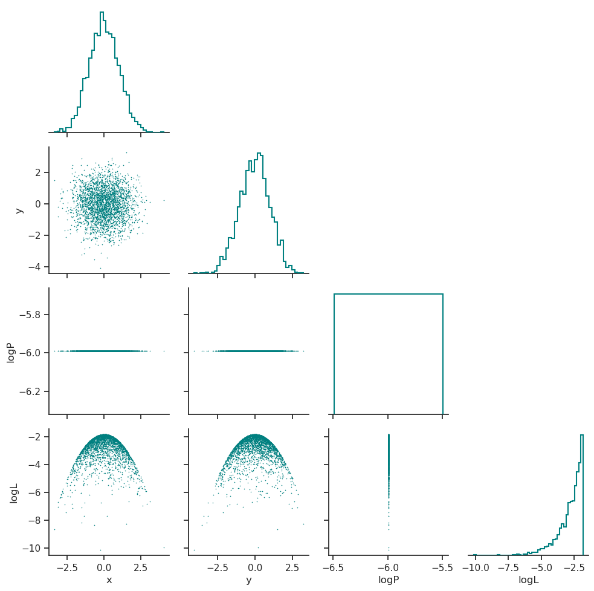
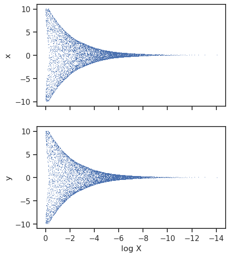
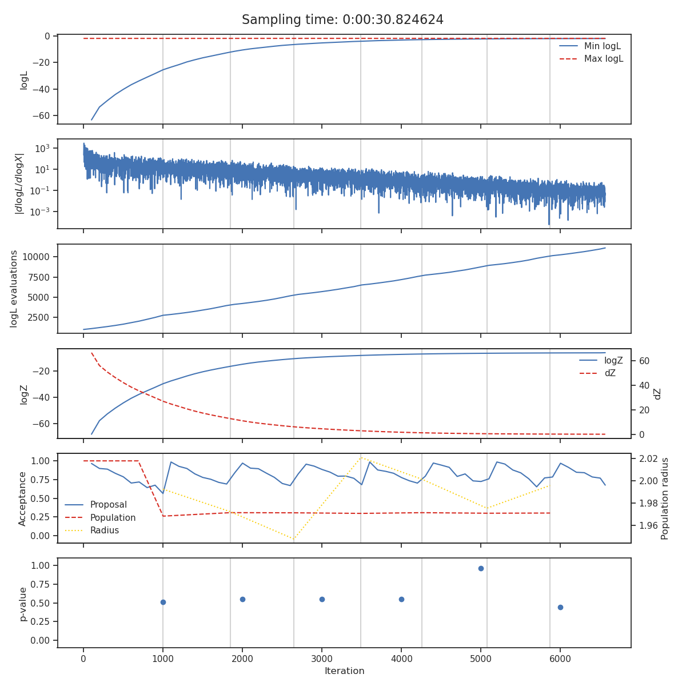
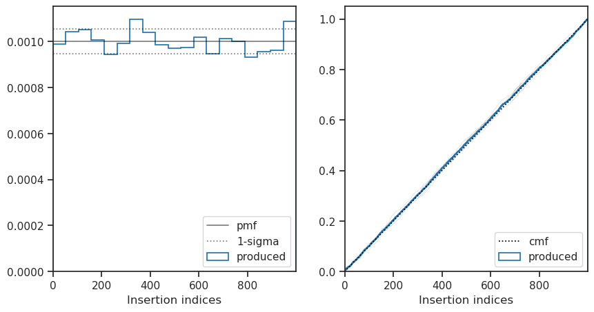

=======================
Simple Gaussian example
=======================

This page show a complete example of running ``nessai`` including setting up the logger, defining a model, configuring the sampler and finally running the sampler. The code for this example is included in `example directory <https://github.com/mj-will/nessai/tree/master/examples>`_.

Code
====

.. literalinclude:: ../examples/2d_gaussian.py
    :language: python

Output
======

In this examples the sampler with save the outputs to ``outdir/2d_examples/``. The following is a explanation of the files in that directory.

Posterior distribution
----------------------

The posterior distribution is plotted in ``posterior_distribution.png``, this includes the distributions for the parameters that were sampled and the distribution of the log-prior and log-likelihood.

Trace
-----

The trace plot shows the nested samples for each parameter as a function of the log-prior volume.

State
-----

The *state* plot shows all the statistics which are tracked during sampling as a function of iteration. From top to bottom these are

* The minimum and maximum log-likelihood of the current set of live points
* The cumulative number of likelihood evaluations
* The current log-evidence :math:`\log Z` and fraction change in evidence :math:`\text{d}Z`
* The acceptance of the population and proposal stages alongside the radius use for each population stage.
* The :math:`p`-value of the insertion indices every ``nlive`` live points

The iterations at which the normalising flow has been trained are indicated with vertical lines and total sampling-time is shown at the top of the plot.

Insertion indices
-----------------

The distribution of the insertion indices for all of the nested samples is shown on the left along with the expect uniform distribution and the 1-sigma bounds determined by the total number of live points. The cumulative mass function is shown on the right where the uniform function is shown with a dashed line, the overall distribution shown in blue and the distribution every ``nlive`` live point shown in light grey.

This plot is useful when checking if the sampler is correctly converged, a non-uniform distribution indicates the sampler is either under or over-constrained.
